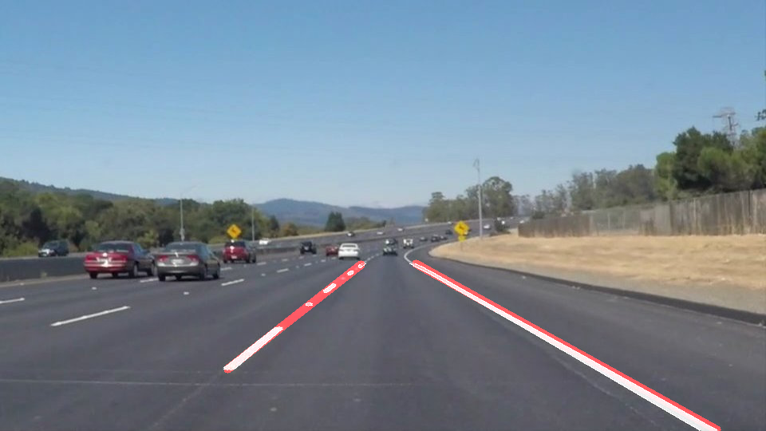

# **Finding Lane Lines on the Road** 

## Author chenklanj@gmail.com

---

**Finding Lane Lines on the Road**

The goals / steps of this project are the following:
* Make a pipeline that finds lane lines on the road
* Describe the key functions 

The input image is:

The output image is

---

### Reflection

### 1. The pipeline process
Followings are my pipelines.  First, image is converted into grayscale, then Gaussian smoothing is carried out as well as cannyedges, where kernel size for gaussian smoothing is 5 and the low and high thresholds for cannyedge function are 50 and 180. Second, four vertices are input for bitwise_and function, to fulfill masked edge process, which is a key process to separate single lines in hough transform. During hough transform function, (2,15,40,20) are four parameters for (rho,threshold,min_line_length,max_line_gap), and the continuous line are connected by several disjointed lines. Finally, two red lines are added to original image and storeed in image or video.

Some math and geometry comparison are chosen to link disconnect lines in hough transform to form 2 lane line. In hough_lines function, left line of  (xlmin,ylmin,xlmax,ylmax) and right line of (xrmin,yrmin,xrmax,yrmax) are defined as two joint lines on the left and right side of lane. (xlmin,ylmin) and (xrmin,yrmin) are set to the max pixels of the images, while (xlmax,ylmax) and (xrmax,yrmax) set to (0,0).  For each line of (x1,y1,x2,y2) in hough transform lines, the line direction of k=(y2-y1)/(x2-x1) is calculated first. If k>0, (x1,y1,x2,y2) is compared to left line parameters, while to the right line parameters. During comparison, the new xlmin is the minimum of (xlmin,x1,x2),  xlmax is the maximum of (xlmax,x1,x2), such as:

     xlmin = min(min(x1,x2),xlmin)
     ylmin = min(min(y1,y2),ylmin)
     xlmax = max(max(x1,x2),xlmax)
     ylmax = max(max(y1,y2),ylmax)

After alll lines finished, the new  (xlmin,ylmin,xlmax,ylmax) and (xrmin,yrmin,xrmax,yrmax) two lines that are along the lane.

The method is tested both image and video, where result folders are test_images_result and test_videos_result. 

### 2. Potential shortcomings with your current pipeline

As in chanllenge.mp4,  detection lines are not fit well with white line. One possibility is that the lane is not always straight and environment noise of trees could not be removed from mask edges.

### 3. Suggest possible improvements to your pipeline

A possible improvement would be to adjust line connection in hough line function. For different  lines, polynomial fitting and spline fitting are effective ways to form continuous and smooth curve.

